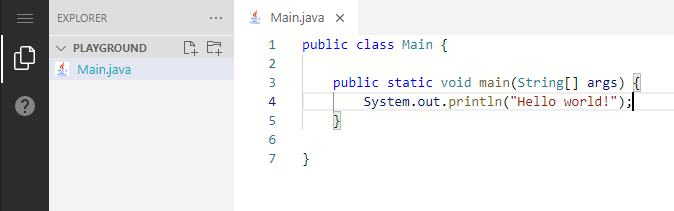

# web-ide

A web-based programming platform.



-   Powered by the [Monaco Editor](https://github.com/microsoft/monaco-editor) (used in [VS Code](https://github.com/microsoft/vscode))
-   Advanced syntax highlighting with [TextMate](https://github.com/microsoft/vscode-textmate) grammars
-   Supports code execution via [Piston](https://github.com/engineer-man/piston)
-   Supports collaborative programming via [Convergence](https://github.com/convergencelabs)
-   Provides persistence via [IndexedDB](https://developer.mozilla.org/de/docs/Web/API/IndexedDB_API) (in-memory) and [File System Access API](https://developer.mozilla.org/en-US/docs/Web/API/File_System_Access_API) (local file system)
-   Integrates the [Student-Management-System-API](https://github.com/Student-Management-System/StudentMgmt-Backend) and [Exercise Submitter](https://github.com/Student-Management-System/exercise-submitter-server) to enable the submission of homework assignments

## Table of Content

-   [Building](#building)
-   [Development](#development)
-   [Important Concepts](#important-concepts)
-   [Testing](#testing)
-   [Component Development with Storybook](#component-development-with-storybook)
-   [Updating Dependencies](#updating-dependencies)

## Building

Install dependencies:

`npm install`

Invoke the following command to build client with production configuration:

`npm run build`

The generated output will appear in `dist/apps/client`.  
URLs of related services can be configured in the **env.js** file inside of this folder.

## Development

The project uses the following technologies:

-   [Angular](https://angular.io) - Frontend framework
-   [NgRx](https://ngrx.io) - Reactive State Management Library
-   [Tailwind CSS](https://tailwindcss.com) - CSS framework
-   [Nx](https://nx.dev) - Build tool
-   [Jest](https://jestjs.io) - Unit Testing
-   [Cypress](https://www.cypress.io) - UI Testing
-   [Storybook](https://storybook.js.org) - Isolated component development, testing and documentation

I recommend using [VS Code](https://github.com/microsoft/vscode) as IDE with the following extensions:

-   [Nx Console](https://marketplace.visualstudio.com/items?itemName=nrwl.angular-console) - UI for Nx commands
-   [Angular Language Service](https://marketplace.visualstudio.com/items?itemName=Angular.ng-template) - Angular related code completion and diagnostics
-   [Angular Snippets](https://marketplace.visualstudio.com/items?itemName=Mikael.Angular-BeastCode) - Collection of useful Angular snippets
-   [Tailwind CSS IntelliSense](https://marketplace.visualstudio.com/items?itemName=bradlc.vscode-tailwindcss) - Auto-completion for CSS classes
-   [Headwind](https://marketplace.visualstudio.com/items?itemName=heybourn.headwind) - Opinionated CSS class sorter
-   [Prettier](https://marketplace.visualstudio.com/items?itemName=esbenp.prettier-vscode) - Opinionated code formatter
-   [ESLint](https://marketplace.visualstudio.com/items?itemName=dbaeumer.vscode-eslint) - Static Program Analysis
-   [i18n Ally](https://marketplace.visualstudio.com/items?itemName=Lokalise.i18n-ally) - Translation management
-   [Add Only](https://marketplace.visualstudio.com/items?itemName=ub1que.add-only) - Easily execute only a single test suite or case

### Getting Started

Ensure that [Node.js](https://nodejs.org/en) and [Git](https://git-scm.com/downloads) are installed on your system.

```sh
# Clone repository
git clone https://github.com/Student-Management-System/web-ide.git

# Change into project directory
cd web-ide

# Install dependencies
npm install

# Install Nx CLI globally
npm install -g nx
```

### Running the Application

```sh
# Build and deploy client locally in watch-mode
# The application will be running at http://localhost:4200
nx serve client
```

### Running Related Services

For local development, all related services can be deployed with [Docker](https://www.docker.com).  
The URLs can be configured in [env.js](apps/client/src/env.js).  
It may not be necessary to run any of these services during development, depending on what feature is being worked on.

#### Student Management System

See https://github.com/Student-Management-System/StuMgmtDocker.

#### Piston (Code Execution)

See https://github.com/Student-Management-System/piston.

```sh
git clone https://github.com/Student-Management-System/piston.git
cd piston

# Build and start container
docker compose up -d

# Install CLI
cd cli && npm install && cd -

# Example: Installing java and python
cli/index.js -u http://localhost:2000 ppman install java
cli/index.js -u http://localhost:2000 ppman install python
```

#### Convergence (Collaborative Programming)

https://hub.docker.com/r/convergencelabs/convergence-omnibus

```sh
# Download Docker image
docker pull convergencelabs/convergence-omnibus

# Start container and map to port 8000
docker run -p "8000:80" convergencelabs/convergence-omnibus
```

## Important Concepts

### TypeScript Strict Mode

TypeScript's [strict](https://www.typescriptlang.org/tsconfig#strict) mode is enabled everywhere. Most importantly, that means `null` and `undefined` must be handled explicitly.

To make a value _nullable_, create a union type: `let nullableNumber: number | null = null;`  
Types can include both `null` and `undefined`.

Example:

```ts
type Person = {
	firstname: string;
	middlename?: string; // Equal to "middlename: string | undefined;"
	lastname: string | null;
}

// valid - properties of type "undefined" may be omitted
const person1: Person {
	firstname: "Max",
	lastname: null
}

// invalid - a nullable property cannot be omitted
const person2: Person {
	firstname: "Max"
}

// invalid - null is not assignable to "firstname"
const person3: Person {
	firstname: null,
	lastname: "Mustermann"
}
```

The TypeScript compiler does not allow us to access properties or methods of a possibly `undefined` or `null` value.
In this case, you can use the _save navigation operator_ or wrap the code into a scope, where the value is guaranteed to be defined.

```ts
const person = tryGetPerson(); // Returns Person | undefined
const invalid = person.firstname; // Not allowed, because person may be undefined
const firstname: string | undefined = person?.firstname;

if (person) {
	// Compiler knows that "person" is defined here
	const firstname: string = person.firstname;
}
```

Since the compiler is not omniscient, there may be cases where we must tell the compiler that a value will be defined (Examples: `@Input()` properties of an Angular component or after usage of RxJS filter operator). This can be accomplished by prepending the `!` operator.

```ts
// ...
class PersonComponent {
	@Input() person!: Person;

	foo(): void {
		throwErrorIfLastnameIsNull(person);
		console.log(person.lastname!.length);
	}
}
```

### Nx Libraries

The project uses [Nx](https://nx.dev) and follows its recommended [workspace structure](https://nx.dev/l/n/structure/library-types).
Hence, the code within `apps/client` is kept minimal and the majority of features and utils are developed in libraries inside the `libs` folder.

Library names and paths are defined in [tsconfig.base.json](tsconfig.base.json) (Nx manages these configurations automatically).

#### Imports

To import code from a library, use the following syntax rather than using relative or absolute paths:

```ts
import { myFunction } from "@web-ide/my-library";
```

In VS Code, set the **typescript.preferences.importModuleSpecifier** (search for it in the settings UI) to **project-relative**. This ensures that auto-imports only use relative paths when importing from files within the same library.

When a library has not been referenced before, TypeScript IntelliSense may fail to suggest the auto-import and you have to add the first import manually.

#### Exports

Other libraries can only import exported functions, classes, types, etc. from a library.
The exports of a library are defined in `libs/**/src/index.ts` (so called _barrel files_).  
To export something from a library, the function (or class, etc.) must be exported from the file that it is defined in, as well as re-exported from `index.ts`.

Example:

```ts
// **/src/lib/my-file.ts
export const hello = "world";

// **/src/index.ts
export * from "./lib/my-file.ts";
```

#### Creating Libraries

New libraries can be created using the [Nx Console](https://marketplace.visualstudio.com/items?itemName=nrwl.angular-console) extension like so:

-   Right click the folder, where the library should be created (i.e., `libs/client/feature`)
-   Click "**Nx generate...**"
-   Type "**library**" and choose an appropriate schematic (i.e., Angular library or Workspace library)
-   Fill out the form and press "**Run**"
    -   Most configuration values should already be configured through [nx.json](nx.json)
    -   Before pressing "**Run**" you can see the output that will be generated in the console. This enables you to check, whether the library will be generated at the correct location.

### Angular Components and Modules

Angular components can be created using the [Nx Console](https://marketplace.visualstudio.com/items?itemName=nrwl.angular-console) extension like so:

-   Right click the folder, where the component should be created (i.e., `libs/client/feature/my-library/src/lib`)
-   Click "**Nx generate...**"
-   Type "**component**" and choose the Angular Component schematic (@schematic/angular - component)
-   Fill out the form and press "**Run**"
    -   Use **"style": "none"** (unless the component requires styling that cannot be done with Tailwind CSS)
    -   Use **"skipTests": true** (Project does not use default test setup)
    -   Use **"changeDetection": "OnPush"** (explained below)
    -   Use **"skipImport": true** (SCAM pattern, explained below)
    -   Leave **"module"** empty (SCAM pattern, explained below)
    -   Before pressing "**Run**" you can see the output that will be generated in the console. This enables you to check, whether the component will be generated at the correct location.

There are two important concepts related two components and modules:

**ChangeDetectionStrategy**:  
This project uses the `onPush` change detection strategy. This allows Angular to be more efficient. As a result, a component will only be rerendered when ...

-   Value/Reference of an `@Input()` property changed
-   Observable inside the component emitted a value
-   Event was triggered (i.e., Button click)
-   Change Detection was invoked manually (`ChangeDetectorRef.detectChanges`)

The following example demonstrates how a functionality can be implemented to respect these rules:

```ts
// Will not work reliably with onPush
// counter.component.html
<div>Count: {{ count }}</div>
<button (click)="increase()">+</button>

// counter.component.ts
// ...
class CounterComponent {
	count = 0;
	async increase(): Promise<void> {
		await someAsyncOperation(); // i.e. API request
		this.count++;
	}
}

// onPush version
// counter.component.html
<div>Count: {{ count$ | async }}</div>
<button (click)="increase()">+</button>

// counter.component.ts
// ...
class CounterComponent {
	count$ = new BehaviorSubject(0);
	async increase(): Promise<void> {
		await someAsyncOperation(); // i.e. API request
		const newValue = this.count$.getValue() + 1;
		this.count$.next(newValue);
	}
}
```

By convention, all variables that are _observables_ end with a `$` in their name. In templates, the `async` pipe must be used to access their current value.

**SCAM - Single Component Angular Module**:  
Every Angular component must be declared by exactly one Angular module.
In the HTML template of an Angular component, you can only reference other components, pipes and directives
that are defined in this component's module or imported by it. This project follows the **SCAM** pattern (Single Component Angular module), which means that each component is declared in a unique Module. Doing so makes it easier to identify the dependencies of individual components and avoids having a bloated shared module. Often, the Module is defined within the `*.component.ts` file for simplicity. In the near future, Angular modules will become optional. Following this pattern will make the switch to standalone components straightforward.

Example:

```ts
@Component({
	selector: "web-ide-courses",
	templateUrl: "./courses.component.html",
	changeDetection: ChangeDetectionStrategy.OnPush
})
export class CoursesComponent {
	@Input() courses!: CourseDto[];
	@Output() selected = new EventEmitter<CourseDto>();
}

@NgModule({
	declarations: [CoursesComponent],
	exports: [CoursesComponent],
	imports: [CommonModule, SemesterPipeModule, TranslateModule]
})
export class CoursesComponentModule {}
```

### NgRx - State Management

This project uses the [NgRx](https://ngrx.io) state management library, which provides a popular framework for state management.
Read the [documentation](https://ngrx.io/guide/store) for more information about its core concepts. In this project, Actions and Selectors can be used as follows:

```ts
export class CoursesComponent implements OnInit {
	courses$ = this.store.select(StudentMgmtSelectors.user);

	constructor(private store: Store) {}

	ngOnInit(): void {
		// Will eventually update "StudentMgmtSelectors.user" and hence "courses$"
		this.store.dispatch(StudentMgmtActions.loadCourses());
	}
}
```

For easier debugging, you can install the **Redux DevTools** browser extension, which allows you to inspect the current application state, view logs of all dispatched actions and more.

-   Chrome - https://chrome.google.com/webstore/detail/redux-devtools/lmhkpmbekcpmknklioeibfkpmmfibljd
-   Firefox - https://addons.mozilla.org/de/firefox/addon/reduxdevtools/

## Testing

### Unit Tests

Invoke the following command to run all unit tests:  
`npm run test`

To run tests for a specific library, use this command:  
`nx test LIBRARY-NAME`

Here **LIBRARY-NAME** must be replaced with the libraries name as specified in [workspace.json](workspace.json) (i.e., library in "libs/shared/util/programming" is called "shared-client-programming").

Additionally, you may want to use the following [Jest CLI options](https://jestjs.io/docs/cli):

-   --watch - Runs tests whenever a related file changes
-   --runInBand - Runs tests serially instead of using multiple threads. Tests may run faster.
-   --testPathPattern=abc.spec.ts - Only runs tests in "abc.spec.ts".

You may also use the [Add Only](https://marketplace.visualstudio.com/items?itemName=ub1que.add-only) extension to only run a specific test or _describe_-block.

### UI Tests

By default, [Cypress](https://www.cypress.io) runs UI tests that against the locally deployed application instance at http://localhost:4200.

Therefore, run the application as stated above using `nx serve client` and invoke `npm run cypress:client` in another terminal instance to open the Cypress Test Runner.

If you are using Linux, you may also need to install some [additional dependencies](https://docs.cypress.io/guides/getting-started/installing-cypress#System-requirements). If you are using [WSL](https://docs.microsoft.com/en-us/windows/wsl/about), follow [this guide](https://nickymeuleman.netlify.app/blog/gui-on-wsl2-cypress) (might no longer be necessary for Windows 11).

Once the Test Runner is open, you can click "Run X integration specs" to run all UI tests or choose a specific test suite.
When a file is changed, Cypress will automatically rerun the tests. During development, use the [Add Only](https://marketplace.visualstudio.com/items?itemName=ub1que.add-only) extension to only run a specific test or _describe_-block.

The UI tests for the `client` are located in `apps/client-e2e`.
The `src` folder of `client-e2e` has the following contents:

-   **integration**: Contains the test suites
-   **fixtures**: Contains `.json` files with responses from backends services such as the Student-Management-System-API and Exercise Submitter Server.
    -   Used to mock backend services during tests.
    -   Obviously, it is also possible to use real services during tests. See https://docs.cypress.io/guides/guides/network-requests#Testing-Strategies for more information.
    -   Examples:

```ts
// Intercept GET request to any url that ends with "/courses/{id}/assignments/{id}"
// Use .json of fixtures/student-mgmt/assignment
cy.intercept("GET", "**/courses/*/assignments/*", {
	fixture: "student-mgmt/assignment"
}).as("assignment"); // Display name in UI

// Use custom object as response
cy.intercept("GET", "http://example.url", {
	statusCode: 200,
	body: {
		hello: "world"
	}
});

// Simulate 401 response
cy.intercept("POST", "http://example.url", {
	statusCode: 401
});

// Simulate network error
cy.intercept("GET", "http://example.url", {
	forceNetworkError: true
});
```

-   **support**: Cypress enables developers to add custom methods to the global `cy` object. Most notably, this project adds a `cy.getBySelector` method, which accepts a string containing the name of a `data-test="..."` HTML attribute. This attribute makes it easier to reliably reference UI elements, since CSS class names or element hierarchies are prone to change often. These selectors are documented in [selectors.ts](libs/shared/testing/src/lib/ui/selectors.ts).

## Component Development with Storybook

[Storybook](https://storybook.js.org) is a tool that enables the development of **UI components** (presentational components) in isolation and can furthermore be used to document and test components.

It is important to note, that Storybook only works well with _presentational components_, meaning components that receive their data as `@Input()` and communicate via `@Output()` and that do not have any dependencies in their constructor, because otherwise these would have to be mocked away. Separating between these kind of _presentational components_ that define the UI and _smart components_ that implement logic is considered good practice and Storybook promotes this style of development.

Invoke the following command to open the Storybook of this project:

`npm run storybook`

Once the application has been build and deployed, the Storybook will be hosted at http://localhost:4400.  
Storybook will automatically refresh, when a file is changed.

### Adding a New Story

A new entry in the Storybook can be created as follows:

1. In the same directory as the component, define a file called `*.stories.ts`;
2. Insert the Storybook boilerplate code (see VS Code snippet below) and specify the component

```ts
import { Meta, moduleMetadata, Story } from "@storybook/angular";
import { MyComponent, MyComponentModule } from "./my-component.component";
import { StorybookTranslateModule } from "@web-ide/shared/storybook";

export default {
	title: "MyComponent",
	component: MyComponent,
	decorators: [
		moduleMetadata({
			imports: [MyComponentModule, StorybookTranslateModule]
		})
	]
} as Meta<MyComponent>;

const Template: Story<MyComponent> = (args: MyComponent) => ({
	component: MyComponent,
	props: args
});

// Stories
export const Default = Template.bind({});
Default.args = {
	myValue: "hello world"
};

export const Empty = Template.bind({});
Empty.args = {
	myValue: ""
};
```

In Storybook, there should now be `MyComponent` with these two stories:

-   Default
-   Empty

If the component requires translations, import the `StorybookTranslateModule` as shown above.

You may want to add the following [VS Code snippet](https://code.visualstudio.com/docs/editor/userdefinedsnippets#_create-your-own-snippets) to your TypeScript snippets to automatically generate this boilerplate code.

```json
"story": {
	"prefix": "story",
	"body": ["import { Meta, moduleMetadata, Story } from \"@storybook/angular\";", "", "", "export default {", "\ttitle: \"$1\",", "\tcomponent: $1,", "\tdecorators: [", "\t\tmoduleMetadata({", "\t\t\timports: [$2]", "\t\t})", "\t]", "} as Meta<$1>;", "", "const Template: Story<$1> = (args: $1) => ({", "\tcomponent: $1,", "\tprops: args", "});", "", "export const Default = Template.bind({});", "Default.args = {$0};"],
	"description": "Creates a storybook story for an Angular component."
}
```

### Testing with Storybook and Cypress

Storybook can be used in combination with [Cypress](https://www.cypress.io). This enables you to test, whether the component displays the desired information. These type of tests are defined in `apps/shared-storybook-e2e`. Instead of visiting the complete application, Cypress will visit the Storybook _iFrame_ that hosts the component's story, allowing it to be tested in isolation.

There is a useful command defined on the global cypress object: `cy.visitIFrame`, which expects the component name and story name as parameters (see example for correct naming). Additionally, you may specify a union type inside the generic as displayed below. This provides some additional type safety and auto-completion. To identify the component and story names, look at the URL of your browser when opening a story:

```ts
// Optional: union type to avoid typos when referencing these stories below
type StoryName = "default" | "empty"; // Notice: lowercase (+ camelCase is transformed to kebab-case)
const component = "mycomponent"; // Notice: lowercase

describe("MyComponent", () => {
	describe("Default", () => {
		beforeEach(() => cy.visitIFrame<StoryName>(component, "default"));

		// ... some Cypress tests
	});

	describe("Empty", () => {
		beforeEach(() => cy.visitIFrame<StoryName>(component, "without-end-date"));

		// ... some Cypress tests
	});
});
```

## Updating Dependencies

### Nx, Angular, Jest, Cypress and Storybook

[Nx](https://nx.dev) provides a convenient way to update packages to their latest version via the [nx migrate](https://nx.dev/l/a/cli/migrate) command.
Besides updating versions, Nx also also performs necessary workspace changes with automated migration scripts (i.e. adapting code to breaking changes or changing default configuration values).

As described in the [documentation](https://nx.dev/l/a/core-concepts/updating-nx), invoking the following commands will update Nx and supported packages (Angular, NgRx, Jest, Cypress, Storybook).

```sh
# Before: Ensure that there are no uncommitted changes

# Set packages to latest (supported) version (does not install)
nx migrate latest

# Install updated packages
npm install

# If migrations are necessary (see console output from previous steps)
nx migrate --run-migrations

# migrations.json can be deleted, once migrations have completed successfully
```

### Other Dependencies

Other dependencies must be updated manually. You can invoke `npx npm-check-updates` to check all packages for their latest version to find dependencies that may be updated. It is also possible to update all at packages at once by passing the `-u` flag, but this is a recipe for disaster.

### Upgrading Monaco Editor

The [Monaco Editor](https://github.com/microsoft/monaco-editor) assets are located at `apps/client/generated`.
These assets are generated with TODO and then copied into this directory.
